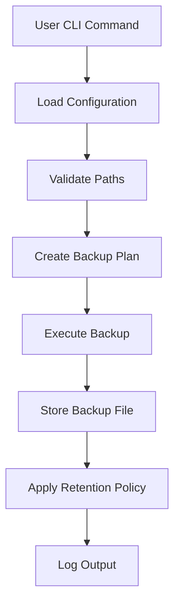

# Savr

A robust command-line utility for automating and managing file and directory backups. Designed for developers, sysadmins, and power users, `savr` streamlines backup operations with a flexible configuration system and support for various storage destinations. The tool focuses on reliability, repeatability, and transparency, helping you understand exactly what gets backed up and when. It aims to reduce human error in backup routines by encoding your backup strategy in code and configuration rather than fragile manual processes.

---

## Introduction

`savr` offers a simple yet powerful way to create and manage backups from the terminal. It supports customizable backup strategies, incremental and full backups, and multiple storage backends. The tool empowers users to automate protection of important files, ensuring data safety and disaster recovery. You can integrate it into existing workflows, scripts, and schedulers so that backups run consistently without manual supervision.

---

## Features

- **Incremental & Full Backups**: Perform efficient backups to save time and storage. Full backups capture the entire selected dataset at a specific point in time, creating a complete snapshot for disaster recovery. Incremental backups only copy files that changed since the last backup, which minimizes storage usage and reduces backup duration. The tool can combine these strategies, allowing you to run periodic full backups and frequent incremental ones for a balanced approach.

- **Multiple Destinations**: Local disk, network shares, cloud storage, and more. You can direct backup archives to local folders, external drives, or mounted network volumes like NFS and SMB shares. With suitable configuration or additional tooling, you can also send backups to cloud buckets and object storage solutions. This flexibility helps you design multi-layer backup strategies, such as on-site fast restores and off-site disaster protection.

- **Flexible Configuration**: Adjust source paths, exclusions, schedules, and retention policies. All critical backup behavior lives in a configuration file, so you can version it alongside your code or infrastructure. You can define multiple source directories, apply fine‑grained exclusion rules, and customize destination paths for different environments. Scheduling and retention options let you express your backup policy clearly, which improves maintainability over ad‑hoc scripts.

- **Easy Restoration**: Restore entire backups or select files with minimal effort. The restore command reads backup metadata and reconstructs your files to a chosen location. You can perform full restores to recover complete systems or selectively restore only specific directories or files. This selective capability is valuable when users accidentally delete data or overwrite a few files without needing a full rollback.

- **Dry Run & Verbose Modes**: Simulate backups and get detailed logs. Dry run mode lets you preview which files would be included, excluded, or overwritten without writing any data. Verbose logging shows each step of the process, including file selection, compression, and retention actions. These modes help you validate new configurations safely and troubleshoot unexpected backup behavior.

- **Cross-Platform**: Works on Linux, macOS, and Windows. The CLI uses Node.js, which provides a consistent runtime across common operating systems. Path handling and file operations follow platform conventions, so you can use the same tool on local workstations and servers. This cross‑platform support simplifies documentation, training, and automation in heterogeneous environments.

- **Automation Friendly**: Integrates with cron, task schedulers, and CI pipelines. Since it runs as a standard CLI command, you can schedule backups using cron on Unix systems or Task Scheduler on Windows. CI pipelines can run backups before destructive operations like database migrations or deployments. This automation support encourages regular, repeatable backups instead of sporadic manual runs.

---

## Installation

Install `savr-cli` using one of the following methods. Choose the global npm installation if you want the command available system‑wide. Use the source installation when you need to inspect, modify, or contribute to the codebase. Both approaches rely on Node.js and npm, so ensure they are installed before proceeding.

### Using npm

```bash
npm install -g savr-cli
```

This command installs the package globally, making the `savr` command available in your shell. You may need administrator or superuser privileges depending on your system configuration. After installation, you can run `savr --version` to confirm that the CLI is correctly installed.

### From Source

Clone the repository and install dependencies:

```bash
git clone https://github.com/11Warrior/savr.git
cd savr
npm install
npm run build
```

Cloning from source gives you full access to the implementation and build scripts. `npm install` fetches all dependencies defined in the project, and `npm run build` compiles the source into a distributable form. This method is useful if you want to patch bugs locally or experiment with new features before submitting pull requests.

You can then run the CLI via:

```bash
node dist/cli/cli.run.js
```

Running the compiled entry point with Node.js allows you to test the tool directly from the repository. You can create a shell alias or script wrapping this command if you prefer a shorter invocation. This approach is also useful in containerized or isolated environments where global npm installations are not desirable.

---

## Requirements

- **Node.js v14 or higher**: The tool relies on modern JavaScript features and Node.js APIs introduced in recent versions. Running on Node.js v14 or higher ensures compatibility with asynchronous filesystem operations and stable language constructs. Using older Node.js versions can lead to runtime errors or missing features, so upgrading is strongly recommended.

- **npm package manager**: npm handles installation of `savr-cli` and its dependencies. It resolves version constraints, downloads packages, and manages the global or local installation location. Other package managers like Yarn or pnpm may work, but npm remains the primary tested option.

- **Access to desired backup storage destinations**: The tool needs permission to read source paths and write backups to the destination. For local or network storage, ensure the user running the command has filesystem permissions. For remote or mounted locations, verify that authentication, mounting, and connectivity are correctly configured before scheduling automated backups.

---

## Usage

`savr-cli` uses a command-line interface with various options and commands. Each subcommand focuses on a specific lifecycle action, such as creating, listing, or restoring backups. Options let you point to configuration files, tweak behavior, and control logging without changing code. You can combine options to create powerful scripts tailored to your environment.

### Savr Backup Commands

`savr` currently supports backing up databases directly or from existing dump files. You choose either a database type or a dump filename depending on your workflow.

```bash
savr backup <dbtype>
savr backup <filename>
```

- For `<dbtype>`, use `mongodb` or `postgres`.
- For `<filename>`, use a file ending in `.sql` or `.mongodb`.

### Basic Backup

```bash
savr backup <dbtype>
```

This command creates a backup according to the defined database type(postgres, mongodb). It selects source paths, applies exclusion patterns, and writes the resulting archive to the configured destination. If retention policies are enabled, the same run can also prune old backups after the new archive is created.

### Restore Files

```bash
savr restore <filename>
```

The restore command takes an existing backup archive and extracts its contents to the database either deployed on cloud or locally hosted. You can point to any compatible backup file created by the tool, whether stored locally or downloaded from remote storage. Restores can overwrite existing files in the destination, so consider using a separate folder when testing recovery scenarios.

### List Available Backups
You can view your backed up files from /backup folder under the folder /postgres for postgres database and /mongodb for mongodb database. The destination is /backup/postgres and /backup/monogodb. Your backup files are there. 

### Help

Get a full list of available commands and options:

```bash
savr --help
```

The help output documents each subcommand, its flags, and expected arguments. It often provides short usage examples that you can adapt for your own scripts. When upgrading versions, revisit the help text to discover new options or behavioral changes that might benefit your setup.

---

## Configuration

The tool uses a JSON configuration file to specify what and how to back up. Centralizing settings in a file makes backups reproducible and easier to review or audit. You can maintain different configuration files for various environments, such as development, staging, and production. This approach allows you to run the same command with different configurations, avoiding hard‑coded paths in scripts.

Below is an example configuration:

```json
{
  "source": [
    "/home/user/Documents",
    "/home/user/Pictures"
  ],
  "destination": "/mnt/backup-drive",
  "exclude": [
    "**/*.tmp",
    "**/node_modules/**"
  ],
  "retention": {
    "maxBackups": 7
  },
  "schedule": "0 2 * * *", // Optional: cron syntax
  "compression": true
}
```

### Configuration Fields

- **source**: Array of files/directories to back up. Each entry represents a path that the tool will scan recursively, unless otherwise configured. You can include both absolute and relative paths, though absolute paths are generally safer in scheduled jobs. Multiple sources allow you to protect different areas of your filesystem in a single backup run.

- **destination**: Path or URL to store backups. This can be a local directory, an external drive mount point, or a network share. The tool writes backup archives and optional metadata files into this location, so ensure sufficient disk space. Storing backups on a different physical device than the source reduces risk from hardware failures.

- **exclude**: Patterns to exclude from backup. These patterns typically use glob syntax, letting you skip temporary files, build artifacts, or other nonessential data. Excluding large or rapidly changing folders can significantly reduce backup size and speed up runs. Thoughtful exclusion rules help focus your backups on truly valuable content.

- **retention**: Policy to keep/remove old backups. In the example, `maxBackups` limits the number of stored archives, deleting the oldest when the threshold is exceeded. Retention prevents uncontrolled growth of backup storage and keeps only the most relevant restore points. You can adjust this setting based on storage capacity and recovery requirements.

- **schedule**: (Optional) Cron-style string for scheduled runs. This value expresses when backups should run, such as nightly or hourly, using the familiar cron format. Some environments may use external schedulers that ignore this field, while others might read it to configure jobs. Including it in configuration documents your intended schedule alongside backup logic.

- **compression**: Enable or disable archive compression. When enabled, the tool compresses backup data to reduce disk usage at the cost of extra CPU time. Compression is beneficial for large text or highly redundant data but may offer limited gains on already compressed formats. You can toggle this flag to balance performance and storage efficiency.

---

## Architecture Overview

The following diagram illustrates the main workflow of the backup process. It shows how user input, configuration, validation, execution, and logging connect during a typical run. Understanding this flow helps when debugging unexpected behavior or extending the tool. Each step represents a logical phase that you can instrument or adjust if you modify the codebase.



---

## Contributing

We welcome contributions from the community! To get started:

- Fork the repository
- Create a new branch for your feature or bugfix
- Make your changes and add tests
- Submit a pull request with a clear description

Forking the repository creates your own copy where you can experiment without affecting the original project. Creating a dedicated branch isolates each feature or bugfix, making it easier to review and, if necessary, revert. Adding tests ensures that your changes do not introduce regressions and that future contributors understand the expected behavior. A clear pull request description helps maintainers quickly grasp your intent, review the implementation, and provide constructive feedback.

For contributing to the CLI itself, you can set up a local development environment with these steps. Fork the repo, clone it locally, run `npm install`, then run `npm run build`. After building, run the compiled `cli.run.js` file from the `dist` directory using `ts-node` to exercise the CLI during development.

Please follow the existing code style and write appropriate tests for new features. Consistent style keeps the codebase readable and maintainable for everyone. When in doubt, look at existing files as examples for formatting, naming, and patterns. If you introduce significant changes, consider updating documentation so users can benefit from new capabilities.

---

## License

This project is licensed under the MIT License. See the [LICENSE](./LICENSE) file for details. The MIT License is a permissive open-source license that allows commercial use, modification, distribution, and private use with minimal restrictions. It mainly requires preservation of copyright and license notices, making it suitable for both open and closed source projects.

---

## Support

For issues, questions, or feature requests, please open an issue on the [GitHub repository]([https://github.com/11Warrior/savr/issues]). When reporting problems, include your operating system, Node.js version, and a description of the steps to reproduce the issue. Attaching relevant logs or configuration snippets can significantly speed up diagnosis and resolution. Feature requests are also welcome and help guide the project roadmap based on real user needs.

---

Thank you for using **savr-cli** and helping make data protection simpler and safer! Your feedback and contributions directly improve reliability, usability, and feature coverage. By sharing your experiences and use cases, you help shape a tool that serves a wider community of users.
